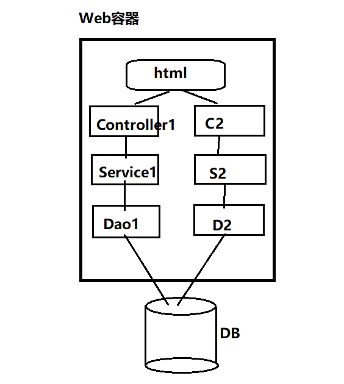

## SpringCloud

### 什么是微服务？

要想学习微服务，首先需要知道什么是微服务？为什么会有微服务？相信看完架构的发展史读者就会明白

#### 架构发展史

##### 单体应用架构

如图所示：将所有的模块，所有内容(页面、Dao、Service、Controller)全部写入一个项目中，放在一个Tomcat容器中启动**适用于小型项目**

优点：开发速度快，可以利用代码生成工具快速的开发一个项目

缺点：不易扩展，代码耦合度高，且不容错(当某部分出错后整个服务就会停止运行)

##### 垂直架构

既然原来单体架构中代码耦合度高，不利于维护和运行，人们自然就想到将不同的内容分开。最简单合理的方式就是将系统按照功能划分成不同的模块，然后将各模块独立放入不同的Web容器中，这就形成了垂直架构

优点：代码耦合度降低，且不同模块之间可以独立运行。一旦某个模块压力过大，可以针对性的搭集群

缺点：模块之间有可能不是那么完全独立，导致实体类或者其他层代码不能复用，需要多出粘贴，不方便日后维护。如果直接通过HTTP调用又不是很合理。

##### 分布式架构/分布式SOA架构

分布式架构顾名思义就是分散部署在不同的机器上的服务，一个服务可能负责几个功能，是一种面向SOA架构的，服务之间也是通过rpc来交互或者是webservice来交互的架构。从开发的角度看就是Controller层(服务消费者)和Service层(服务提供者)分成不同的项目，部署在不同的服务器上，通过RPC(远程方法调用)来实现交互。阿里巴巴著名的Dubbo框架就是作为分布式架构的框架。一般推荐使用Zookeeper作为服务的注册中心，负责注册和发现服务的提供者，并供服务的消费者消费

##### 微服务

微服务的提出者[马丁·福勒](https://martinfowler.com/)关于微服务的论文[中文翻译版](http://blog.cuicc.com/blog/2015/07/22/microservices/)

单体架构和微服务的比较图示：

微服务的核心就是将传统的一站式应用，根据业务拆分成一个个原子应用。彻底地去耦合，一个服务只做一件事情，从技术角度讲就是一个服务就是一个进程，可以单独启动或销毁，拥有独立的数据库。并且通过配置中心可以方便的切换数据库等。

优点：

- 每个服务足够内聚，足够小，代码容易理解，一个服务可能就是专一的只干一件事。开发简单、开发效率提高
- 微服务能够被小团队单独开发，这个小团队可以是由2到5人的开发人员组成
- 微服务能使用不同的语言开发。易于和第三方集成，微服务允许容易且灵活的方式集成自动部署，通过持续集成工具，如Jenkins, Hudson, bamboo 。微服务允许你利用融合最新技术。
- 微服务易于被一个开发人员理解，修改和维护，这样小团队能够更关注自己的工作成果。无需通过合作才能体现价值。

缺点：

- 开发人员要处理分布式系统的复杂性，会面临分布式事务、分布式一致性等问题
- 多服务运维难度，随着服务的增加，运维的压力也在增大
- 服务间通信成本变高

#### 微服务的技术栈

| 微服务条目                             | 落地技术                                                     | 备注 |
| -------------------------------------- | ------------------------------------------------------------ | ---- |
| 服务开发                               | Springboot、Spring、SpringMVC                                |      |
| 服务配置与管理                         | Netflix公司的Archaius、阿里的Diamond等                       |      |
| 服务注册与发现                         | Eureka、Consul、Zookeeper等                                  |      |
| 服务调用                               | Rest、RPC、gRPC                                              |      |
| 服务熔断器                             | Hystrix、Envoy等                                             |      |
| 负载均衡                               | Ribbon、Nginx等                                              |      |
| 服务接口调用(客户端调用服务的简化工具) | Feign等                                                      |      |
| 消息队列                               | Kafka、RabbitMQ、ActiveMQ等                                  |      |
| 服务配置中心管理                       | SpringCloudConfig、Chef等                                    |      |
| 服务路由（API网关）                    | Zuul等                                                       |      |
| 服务监控                               | Zabbix、Nagios、Metrics、Spectator等                         |      |
| 全链路追踪                             | Zipkin，Brave、Dapper等                                      |      |
| 服务部署                               | Docker、OpenStack、Kubernetes等                              |      |
| 数据流操作开发包                       | SpringCloud   Stream（封装与Redis,Rabbit、Kafka等发送接收消息） |      |
| 事件消息总线                           | Spring Cloud Bus                                             |      |

### 什么是Spring Cloud

Spring Cloud 是实现微服务思想落地开发的一整套技术的集合

#### Spring Cloud和Dubbo的区别图解

Spring Cloud开发者文档中文版：

https://springcloud.cc/spring-cloud-dalston.html

Spring Cloud中国社区

http://springcloud.cn/

Spring Cloud中文网

https://springcloud.cc/
